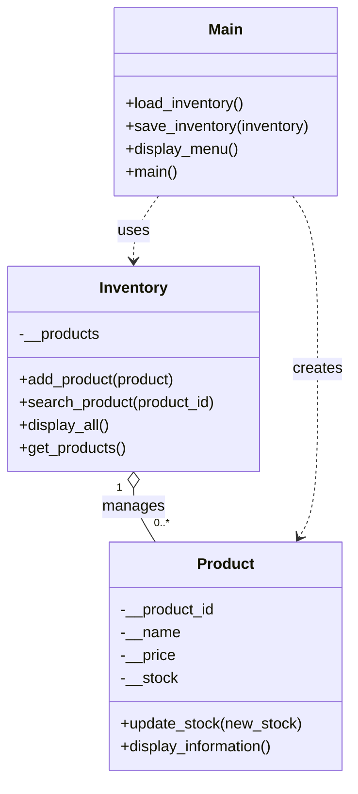

# INF1103 Week 8 Lab — UML Class Diagram

```mermaid
classDiagram
    class Product {
        -__product_id
        -__name
        -__price
        -__stock
        +update_stock(new_stock)
        +display_information()
    }

    class Inventory {
        -__products
        +add_product(product)
        +search_product(product_id)
        +display_all()
        +get_products()
    }

    class Main {
        +load_inventory()
        +save_inventory(inventory)
        +display_menu()
        +main()
    }

    Inventory "1" o-- "0..*" Product : manages
    Main ..> Inventory : uses
    Main ..> Product : creates
```
